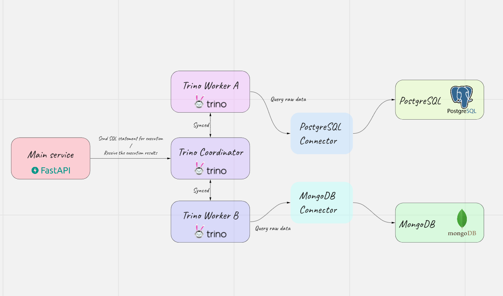

# Trino demo project
## Description
The main idea of the project is to illustrate some abilities of the [trino](https://trino.io/) opensource project as the cross-database query engine

The project services structure is illustrated on the diagram below



The Main service provides a simple API to execute the SQL statements and receive the execution result.

## Instalation
To install and run a project firstly a docker-compose starting compand must be executed because all the services are described within docker notation.

```
$ docker-compose up --build
```
After the sucessfull start next services must be running

```
presto-local-test_main-service_1         /bin/sh -c uvicorn app:cre ...   Up             0.0.0.0:8081->8081/tcp  
presto-local-test_mongo-db_1             docker-entrypoint.sh mongod      Up             0.0.0.0:27017->27017/tcp
presto-local-test_mongo-service_1        /bin/sh -c uvicorn app:cre ...   Up             0.0.0.0:8083->8083/tcp  
presto-local-test_postgresql-db_1        docker-entrypoint.sh postgres    Up             0.0.0.0:5432->5432/tcp  
presto-local-test_postgresql-service_1   /bin/sh -c uvicorn app:cre ...   Up             0.0.0.0:8082->8082/tcp  
presto-local-test_redis_1                docker-entrypoint.sh redis ...   Up             0.0.0.0:6379->6379/tcp  
presto-local-test_trino-coordinator_1    /usr/lib/trino/bin/run-trino     Up (healthy)   0.0.0.0:8080->8080/tcp  
presto-local-test_trino-worker-a_1       /usr/lib/trino/bin/run-trino     Up (healthy)   8080/tcp                
presto-local-test_trino-worker-b_1       /usr/lib/trino/bin/run-trino     Up (healthy)   8080/tcp  
```

Now feel free to connect to each database and fill it with any data you want.

A dump can help with this. Password will be **postgres**

```bash
$ psql --host=localhost --username=postgres --dbname=test --password < postgresql-dump.sql
```

After doing so just use an API running on [**localhost:8081/docs**](http://localhost:8081/docs#/)

Firstly exeute desired SQL statement. Curl example is attached below.

```
curl -X 'POST' \
  'http://localhost:8081/trino/statements/Execute' \
  -H 'accept: application/json' \
  -H 'Content-Type: application/json' \
  -d '{
  "statement": "SELECT * from postgresql.public.accounts"
}'
```

Then use the returned execution id to get information about how many pagination pages are accessible under a specific execution id. The example is attached below.

```
curl -X 'GET' \
  'http://localhost:8081/trino/statements/executions/f81551de-2819-472e-a3c5-0301f6db9ee1/count' \
  -H 'accept: application/json'
```

Finally using "executionId" and a pagination page id as "executionSet" it is possible to obtain execution data

```
curl -X 'GET' \
  'http://localhost:8081/trino/statements/executions/f81551de-2819-472e-a3c5-0301f6db9ee1/1' \
  -H 'accept: application/json'
```

Trino dashboard can be found [here](http://localhost:8080/ui/login.html). Any username can be user to enter dashboard.

## Some helpfull trino commands
To connect to the running trino CLI

```bash
$ docker-compose exec trino-coordinator trino
```
To load running postgresql by dump execte the following query

```bash
$ psql --host=localhost --username=postgres --dbname=test --password < postgresql-dump.sql
```

To show awailable trino catalogs execute the following query

```bash
[trino> show catalogs;
```
To show all schemas inside the catalog execute

```bash
[trino> show schemas in <catalog_name>;
```
To list all available tables

```bash
[trino> show tables from postgresql.public;
```
To list available tables execute the following query

```bash
[trino> describe postgresql.public.accounts;
```
For example to query data with joint in postgresql catalog execute the next query. (WARNING: Ensure the dump was loaded properly!)

```bash
[trino> SELECT accounts.user_id FROM postgresql.public.accounts AS accounts INNER JOIN postgresql.public.tickets AS tickets ON accounts.user_id=tickets.user_id;
```